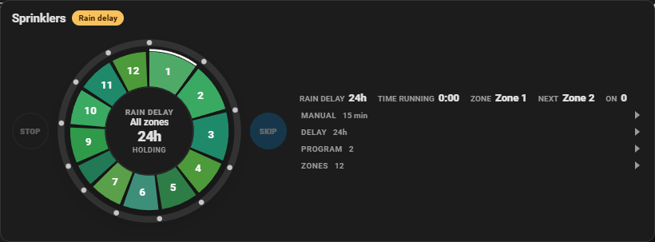
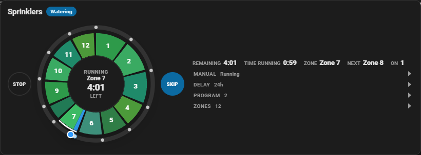
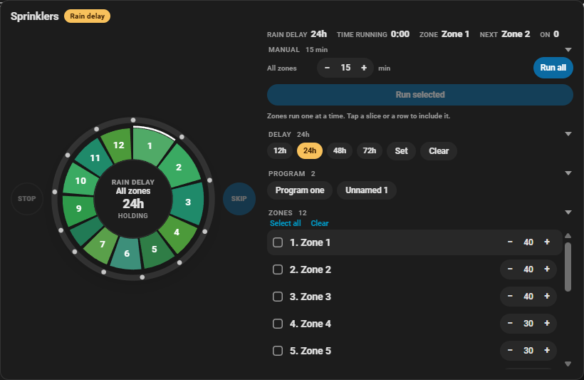

# Sprinkler Plus Card

[](https://github.com/hacs/integration)
[](https://my.home-assistant.io/redirect/hacs_repository/?owner=randrcomputers&repository=ha-sprinkler-card&category=plugin)
[](LICENSE)

Lovelace card for a sprinkler or irrigation controller. Each zone is a slice of a pie (longer runs get a larger slice). While a zone is watering, a blue arc shows how far that run has gone, and the center counts down the time left.

Same card chrome as the other Plus cards: title, status badge, tiles, and 100 / 75 / 50 size.

Works with zone **switches**, **valves**, or toggles. Optional rain-delay switch. **Manual**, **Delay**, **Program**, and **Zones** start folded.







## Install

### HACS (recommended)

If HACS is already on your Home Assistant, click this button to open the repository and download it:

[](https://my.home-assistant.io/redirect/hacs_repository/?owner=randrcomputers&repository=ha-sprinkler-card&category=plugin)

Then **Download**, reload dashboard resources, and hard-refresh the browser (**Ctrl+F5**).

Or add it by hand: **HACS → Frontend → ⋮ → Custom repositories** →

```
https://github.com/randrcomputers/ha-sprinkler-card
```

Category: **Lovelace** / **Dashboard**

### Manual

1. Copy `sprinkler-plus-card.js` to `config/www/`
2. [](https://my.home-assistant.io/redirect/lovelace_resources/) → add `/local/sprinkler-plus-card.js` as a **JavaScript module**
3. Hard-refresh the browser (**Ctrl+F5**)

## Quick start

```yaml
type: custom:sprinkler-plus-card
name: Sprinklers
size: 100
default_duration: 15
durations: "15, 10, 20, 12"
zones:
  - switch.front_lawn
  - switch.side_yard
  - switch.west_lawn
  - switch.back_beds
rain_delay_entity: switch.sprinkler_rain_delay
```

Tap a slice or a zone row to include it, set the minutes on that row, then **Run selected**. Or set one time under **All zones** and press **Run all**. Zones run one after another. **Stop** is left of the dial and **Skip** is right. Both work for a manual run and for a program: Stop ends watering, and Skip moves on to the next zone. **Rain delay** holds the schedule for 12, 24, 48, or 72 hours. A manual run still starts while a delay is on.

Set **Card size** to **50%** in the editor, or `size: 50` in YAML, to shrink the whole card.

## What you see

| Area | Meaning |
| --- | --- |
| Pie slices | One per zone. Size follows that zone’s minutes. |
| Blue arc | How far the running zone is through its time. |
| Center | Manual / Running / Idle / Rain delay, zone name, and time left. |
| Remaining | Time left on the running zone. Shows the planned length when nothing is on. |
| Time running | How long the current zone has been on. |
| Next | The following zone. During a manual run, this is the next zone in the queue. |
| Zones on | How many zones are watering right now. |

**Time running** uses the moment the zone turned on. On a B-hyve controller, **Remaining** follows `current_runtime` for the zone that is open, so a manual run shows the minutes you started, and a program shows that zone’s program time. Otherwise it uses a remaining sensor or attribute (`remaining`, `remaining_seconds`, `time_remaining`, `timer_remaining`, `countdown`, or `remaining_entity`), then the planned minutes minus time running.

On a B-hyve controller the card starts each zone with `start_watering`, so the timer stays on the device. **Skip** and **Stop** use `stop_watering`. Other switches and valves turn off locally when the planned minutes end. Cycles the controller starts on its own are left alone until you skip or stop them.

The center says **Manual** for a run started here, and **Running** when the zone was already on.

## Options

| YAML | Editor | Required | Default | Description |
| --- | --- | --- | --- | --- |
| `name` | Card title | no | `Sprinklers` | Header text |
| `size` | Card size | no | `100` | `100`, `75`, or `50` |
| `zones` | Zones | **yes** | — | Switches, valves, or input booleans. One zone each. |
| `default_duration` | Default zone minutes | no | `15` | Run length when a zone has no minutes of its own |
| `durations` | Minutes per zone (optional) | no | — | Comma-separated minutes, same order as `zones` |
| `rain_delay_entity` | Rain delay (optional) | no | — | Switch, toggle, or sensor. Shows the delay and the hours left. |
| `show_actions` | Show run controls | no | `true` | Run selected, run all, skip, stop, and rain delay |
| `compact` | Compact (rotation slot) | no | `false` | Dial, remaining, and time running for an activity slot. Hides the folded controls. Stop and Skip stay beside the dial. |

### Per-zone names and a remaining sensor

```yaml
type: custom:sprinkler-plus-card
name: Sprinklers
zones:
  - entity: switch.front_lawn
    name: Front Lawn
    duration: 15
  - entity: valve.west_lawn
    name: West Lawn
    duration: 20
    remaining_entity: sensor.west_lawn_remaining
```

`duration` is minutes. A remaining sensor may be seconds, minutes, or `h:mm:ss`.

## Requirements

- Home Assistant **2024.1+**
- One entity per zone (`switch`, `valve`, or `input_boolean`)

## License

MIT — see [LICENSE](LICENSE).
